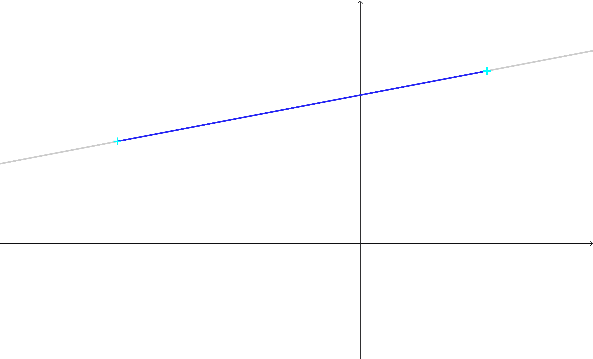
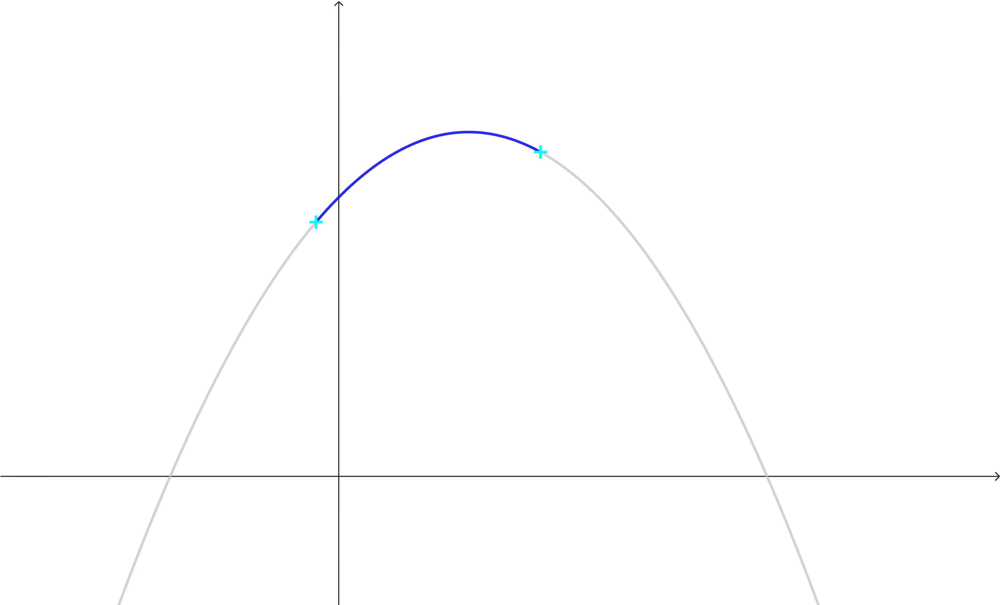
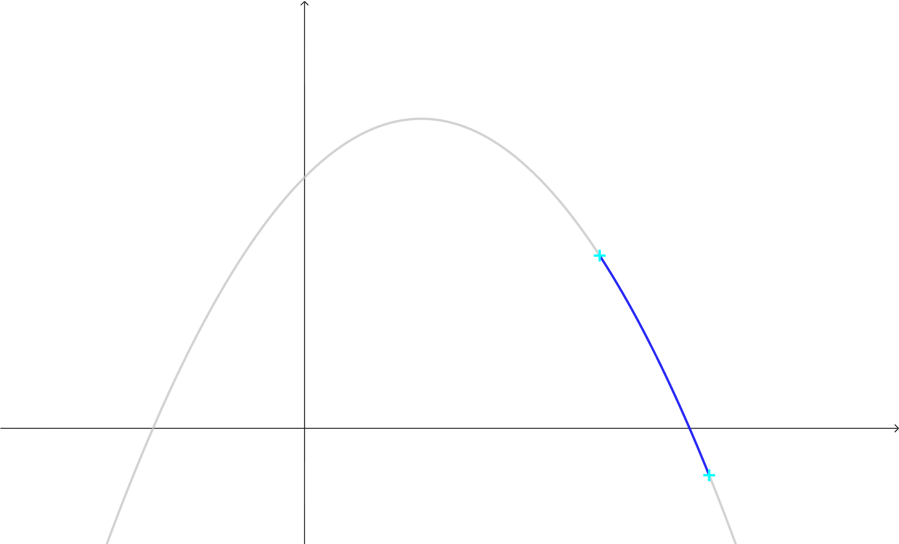

一元二次函数的极值问题，在之前的篇幅已有所表述。

所谓的函数的最值，就是实数集的一个子集的变换的上下确界。
最值是最大值和最小值的统称。
函数的实在太多，能优雅地画出其图形的都是极少数，而我们一般从简单的例子开始研究，即一次函数与二次函数，正如此书书名。

一次函数的最值简单地取决于原像。
注意开集只能逼近。

二次函数本身就有极值，因此当这个特殊的点在目标原像对应的图形上时，可以说一个最值已经确定，而另一个最值还有待讨论。

讨论连续区间，如果顶点不在目标原像对应的图形，那么这一段就是单点增加或单调减少，类似于分析一次函数。

关于二次函数的最值问题，可作一般表述。
讨论一次函数的最值选取，代表了一类更一般的情况，也就是单调函数的最值选取。
讨论区间的函数的最值，可先讨论各个连续部分的最值，再从这些最值中选取一个目标，作为这个函数的最值。
二次函数的增减性转折点也就是顶点。

// TODO: 枚举各种情况（周末作业太多了懒得弄 L w L）

---

2026-03-27